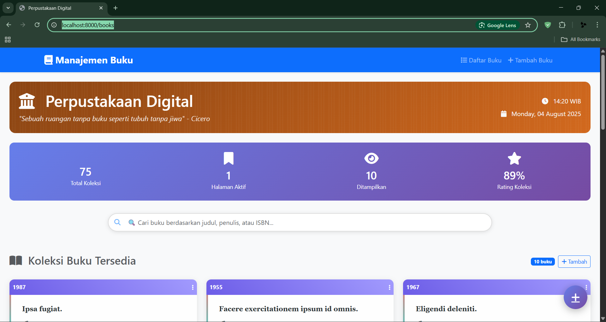
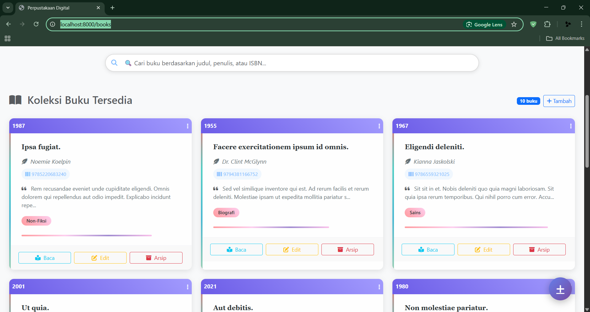
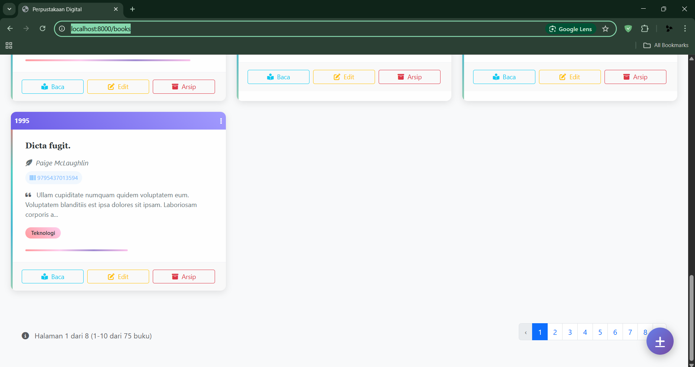
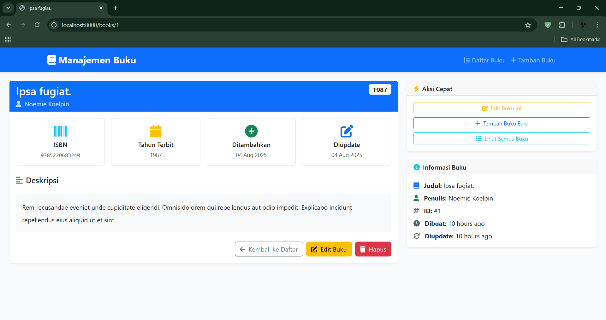
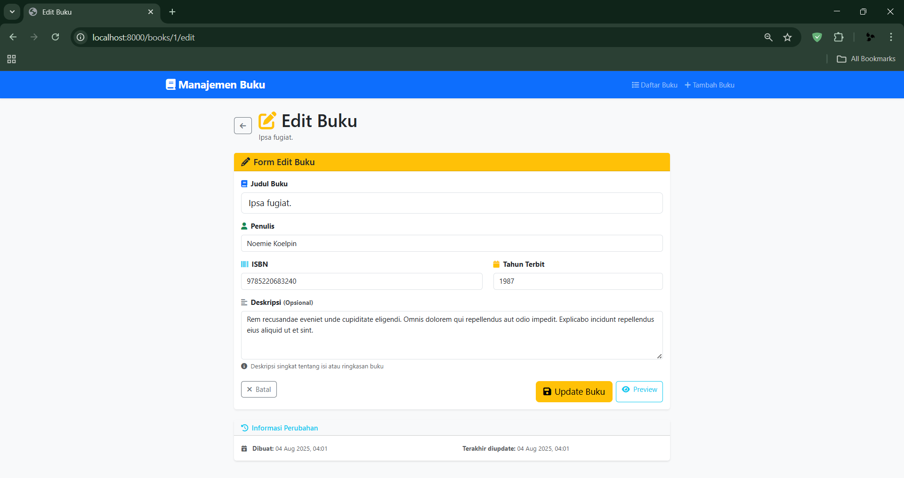
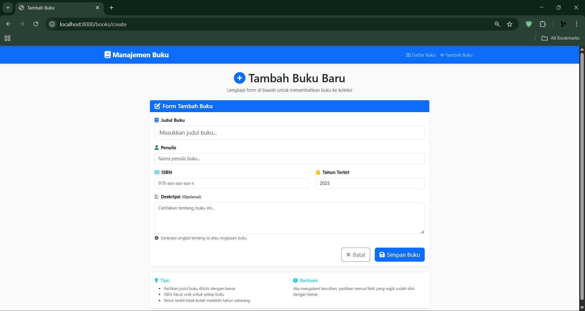

# 📚 Aplikasi Perpustakaan Sederhana

Aplikasi manajemen perpustakaan berbasis web yang dibangun menggunakan framework Laravel 12 dengan arsitektur Model-View-Controller (MVC). Aplikasi ini menyediakan fitur CRUD untuk pengelolaan buku.

## 📸 Screenshot Aplikasi

### 1. Halaman Utama - Dashboard

*Tampilan dashboard utama aplikasi perpustakaan*

### 2. Halaman Utama - Daftar Buku

*Daftar lengkap semua buku dengan fitur pencarian*
*Tampilan card buku dengan aksi baca, edit, hapus*

### 3. Halaman Utama - pagination

*Tampilan pagination melihat data buku lainnya*

### 4. Detail Buku

*Halaman detail informasi lengkap sebuah buku*

### 5. Edit Buku

*Form untuk mengedit informasi buku yang sudah ada*

### 6. Tambah Buku

*Form untuk menambahkan buku baru ke dalam sistem*

## ✨ Fitur Utama

### 📖 Manajemen Buku
- ➕ **Create**: Tambah buku baru dengan informasi lengkap
- 👁️ **Read**: Lihat daftar dan detail buku
- ✏️ **Update**: Edit informasi buku yang sudah ada
- 🗑️ **Delete**: Hapus buku dari database

## 🛠️ Teknologi yang Digunakan

- **Framework**: Laravel 12
- **Arsitektur**: Model-View-Controller (MVC)
- **Database**: MySQL
- **Database running**: Laragon 
- **Frontend**: Blade Templates, Bootstrap 5
- **Icons**: Font Awesome / Heroicons

## 📋 Persyaratan Sistem

- PHP >= 8.2
- Composer
- Node.js & NPM
- MySQL >= 8.0
- Web Server (Apache/Nginx)

## 🚀 Instalasi

### 1. Clone Repository
```bash
git clone https://github.com/username/perpustakaan-laravel.git
cd perpustakaan-laravel
```

### 2. Install Dependencies
```bash
# Install PHP dependencies
composer install

# Install Node.js dependencies
npm install
```

### 3. Konfigurasi Environment
```bash
# Copy environment file
cp .env.example .env

# Generate application key
php artisan key:generate
```

### 4. Migrasi Database
```bash
# Jalankan migrasi
php artisan migrate

# Jalankan seeder untuk data contoh
php artisan db:seed
php artisan migrate:fresh --seed
```

### 5. Jalankan Aplikasi
```bash
composer run dev
```

Aplikasi akan berjalan di `http://localhost:8000`

## 🏗️ Struktur Arsitektur MVC

### 📁 Models
Lokasi: `app/Models/`
- `Book.php` - Model untuk entitas buku

### 🎮 Controllers
Lokasi: `app/Http/Controllers/`
- `BookController.php` - Handle operasi CRUD buku

### 🖼️ Views
Lokasi: `resources/views/`
```
views/
├── layouts/
│   └── app.blade.php
└── books/
    ├── index.blade.php    # 👁️ Daftar buku
    ├── create.blade.php   # ➕ Form tambah buku
    ├── show.blade.php     # 👁️ Detail buku
    └── edit.blade.php     # ✏️ Form edit buku
```

## 🛣️ Routing

### Buku Routes
```php
Route::resource('books', BookController::class);
```
- `GET /books` - 👁️ Tampilkan daftar buku
- `GET /books/create` - ➕ Form tambah buku
- `POST /books` - ➕ Simpan buku baru
- `GET /books/{id}` - 👁️ Tampilkan detail buku
- `GET /books/{id}/edit` - ✏️ Form edit buku
- `PUT /books/{id}` - ✏️ Update buku
- `DELETE /books/{id}` - 🗑️ Hapus buku

## 🗄️ Struktur Database

### Tabel Books
| Field | Type | Description |
|-------|------|-------------|
| id | bigint | Primary key |
| title | varchar(255) | Judul buku |
| author | varchar(255) | Penulis |
| isbn | varchar(20) | Nomor ISBN |
| published_year | year | Tahun terbit |
| stock | int | Jumlah stok |
| created_at | timestamp | Waktu dibuat |
| updated_at | timestamp | Waktu diupdate |

## 🎨 Icon Reference

Aplikasi menggunakan icon yang konsisten untuk setiap aksi:

| Aksi | Icon | Keterangan |
|------|------|------------|
| ➕ Create | `plus` / `add` | Tambah data baru |
| 👁️ Read/View | `eye` / `view` | Lihat detail |
| ✏️ Update/Edit | `pencil` / `edit` | Edit data |
| 🗑️ Delete | `trash` / `delete` | Hapus data |
| 📋 List | `list` / `table` | Daftar data |
| 🔍 Search | `search` / `magnifying-glass` | Pencarian |

## 📝 Cara Penggunaan

### Mengelola Buku
1. Akses menu **Buku** di navbar
2. Klik tombol **➕ Tambah Buku** untuk menambah buku baru
3. Isi form dengan informasi buku (judul, penulis, ISBN, tahun terbit, stok)
4. Gunakan tombol **👁️** untuk melihat detail buku
5. Gunakan tombol **✏️** untuk mengedit informasi buku
6. Gunakan tombol **🗑️** untuk menghapus buku (dengan konfirmasi)

## 🔧 Kustomisasi

### Menambah Field Baru
1. Buat migration baru: `php artisan make:migration add_field_to_table`
2. Update model yang sesuai
3. Modifikasi controller untuk handle field baru
4. Update view untuk menampilkan field baru

### Mengubah Tampilan
1. Edit file blade di folder `resources/views/`
2. Modifikasi CSS di `resources/css/app.css`
3. Build ulang assets: `npm run build`

## 👨‍💻 Developer

Dikembangkan dengan ❤️ menggunakan Laravel 12
